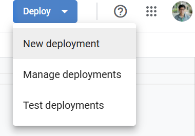
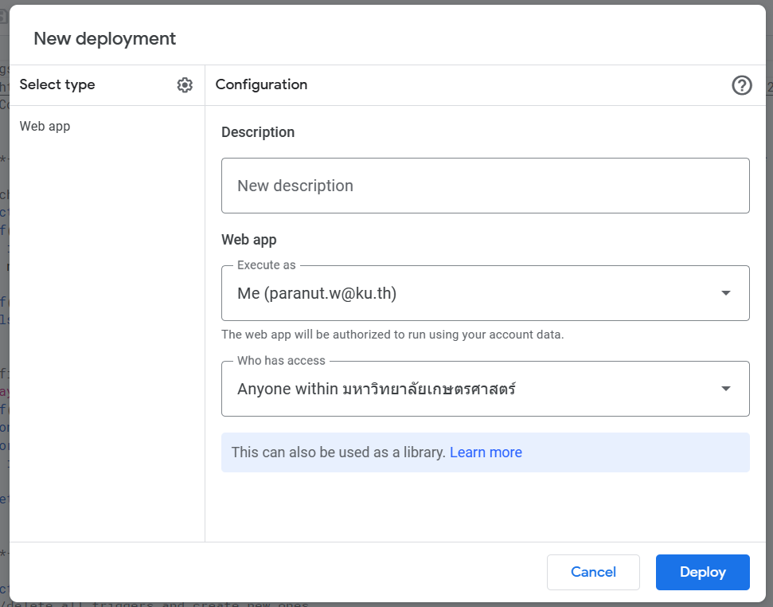
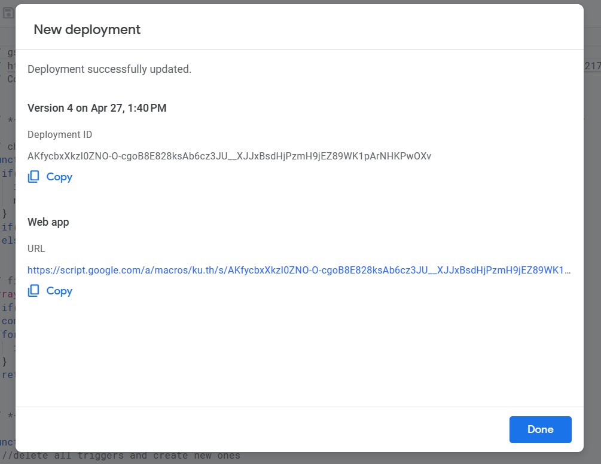
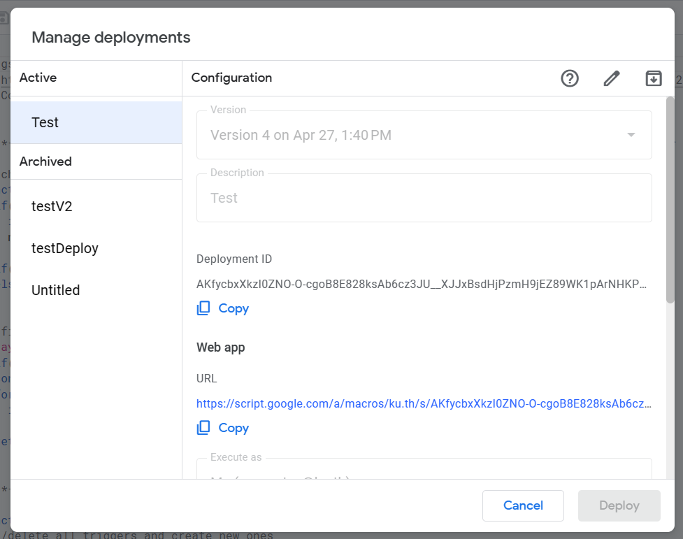
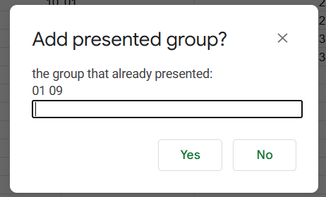
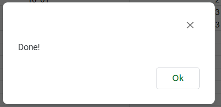
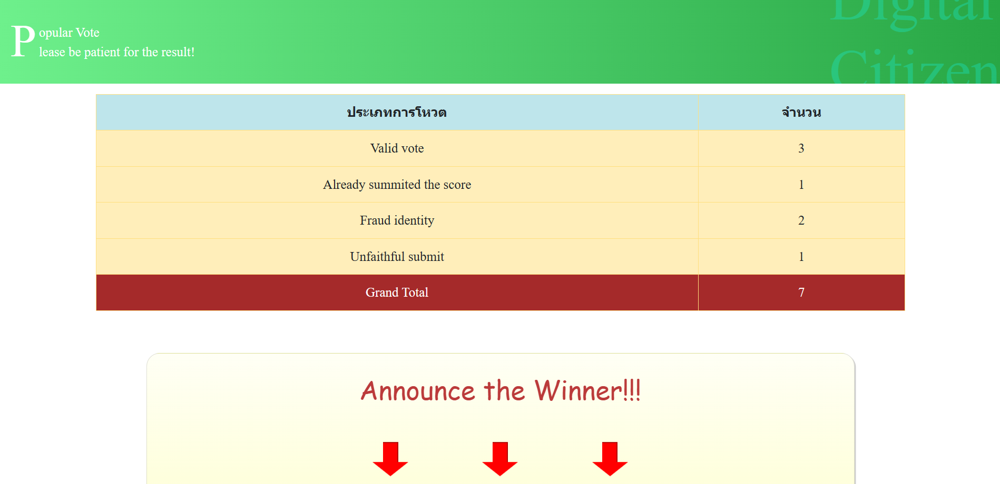
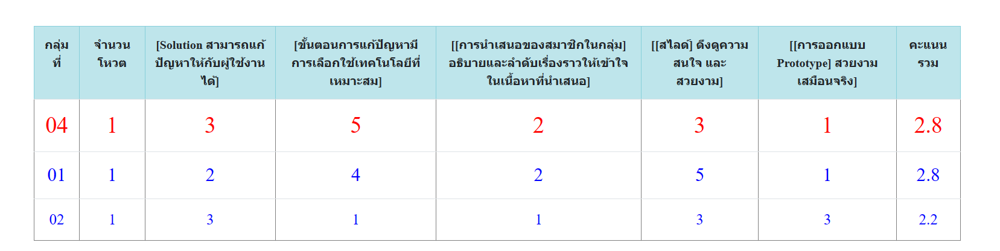

# คำแนะนำการใช้งานสำหรับงาน popular vote
  โปรเจคท้ายเทอม จะให้นักเรียนแบ่งออกเป็นกลุ่ม (ราว ๆ 20 กลุ่ม ตามจำนวนนักเรียนในเทอมนั้น) **นักเรียนทุกคน**จะต้องโหวตให้กับทุกกลุ่มที่มานำเสนอ (มีคะแนนการมีส่วนร่วม) โค้ดในส่วนนี้จะช่วยในการกรองผลโหวต, ประมวลผล, ประกาศออกมาในรูปของ webapp โดยโค้ดจะฝังไว้ที่ google sheet ที่รับผลประเมินจาก google form และตัวโค้ดเองจะสร้าง sheet เพิ่มไว้เก็บข้อมูลของตัวเอง ซึ่งจะมีชื่อ "_voted", "_result", "_frauds" หากไม่มีความจำเป็นก็ไม่ควรแก้ไขไฟล์ดังกล่าว (หากต้องการ restart สามารถลบ sheet ดังกล่าวได้เลย)
  เมื่อถึงเวลานำเสนอให้ start script ที่ sheet ที่รับ response เข้ามา รอจนทำงานเสร็จจึงพร้อมใช้งาน และเมื่อกลุ่มใด ๆ นำเสนอเสร็จ ให้เพิ่มกลุ่มนั้นเข้าไปที่ปุ่ม 'Add group' เพื่อให้ตัว sheet เปิดรับผลโหวตของกลุ่มนั้น ๆ **ทาง TA ต้องเป็นคนเพิ่มกลุ่มที่นำเสนอเสร็จแล้วเอง**
  
  **คะแนนที่เป็นเกณฑ์ในการโหวตมีดังนี้**
- [Solution สามารถแก้ปัญหาให้กับผู้ใช้งานได้]
- [ขั้นตอนการแก้ปัญหามีการเลือกใช้เทคโนโลยีที่เหมาะสม]
- [[การนำเสนอของสมาชิกในกลุ่ม] อธิบายและลำดับเรื่องราวให้เข้าใจในเนื้อหาที่นำเสนอ]
- [[สไลด์] ดึงดูความสนใจ และสวยงาม]
- [[การออกแบบ Prototype] สวยงาม เสมือนจริง]

*ซึ่งเกณฑ์คะแนนสามารถเพิ่มหรือลดได้ โดยจะต้องครอบ "["....."]" ไว้ เพราะตัวโค้ดจะดักจับจากตรงนี้

 **การกรองและจัดประเภทผลโหวต**\
  เนื่องจากเกิดเหตุการณ์ที่ผลโหวตผิดปกติ/ไม่เป็นธรรมอยู่ทุกปี โดยโค้ดนี้จะทำการกรองผลโหวตและจัดประเภทให้ดังนี้
  - 'Valid vote' : ผลโหวตที่ไม่มีความผิดปกติ สามารถนำไปคำนวณเป็นคะแนนจริงของกลุ่มนั้น ๆ ได้
  - 'Fraud identity' : ผลโหวตที่ผู้โหวตมีการระบุตัวตนที่ผิดปกติ เช่น email ที่ไม่มีในรายชื่อ, email รหัสนิสิต และกลุ่มที่ตัวเองอยู่ไม่ถูกต้อง (ข้อมูลพวกนี้ดึงมาจาก sheet ที่มีรายชื่อนิสิตและกลุ่มที่อยู่ ในขั้นตอน 'start script')
  - 'Unfaithful submit' : เกิดได้ 2 กรณีคือ
     - โหวตคะแนนกลุ่มตัวเอง
     - โหวตคะแนนให้กลุ่มที่ยังไม่ได้นำเสนอ (อัพเดตที่ 'Add group')
  - 'Already summited the score' : โหวตในกลุ่มที่โหวตไปแล้ว โค้ดจะรับคะแนนของผลโหวตอันแรกสุดเท่านั้น

## สิ่งที่ต้องมี
1. google sheet ที่เก็บรายชื่อนักเรียนที่แบ่งตามกลุ่ม ซึ่งจะมี format แบบนี้

  
  
  Column ที่จำเป็นต้องใช้(ย้ายที่ไม่ได้) A:ลำดับกลุ่ม B:รหัสนิสิต F:เมลku 
  **ไฟล์นี้ต้อง sort ตามลำดับกลุ่มมาแล้ว และไม่ต้องมี header**\
  *Account ที่รันโค้ดนี้ต้องมีสิทธิ์เข้าถึงไฟล์นี้ได้ อย่างน้อยต้องดูได้ (viewer)*
  
  
2. google sheet ที่รับผลโหวตจาก google form

  
  
  Column ที่จำเป็นต้องใช้(ย้ายที่ไม่ได้) B:email C:รหัสนิสิต D:อยู่กลุ่มที่ E:ให้คะแนนกลุ่มที่
  แต่ส่วนมาก อ.สุนิสาจะเป็นคนสร้าง form อยู่แล้ว ดังนั้นจึงไปขอจาก อ. ได้\
  *Account ที่รันโค้ดนี้ต้องมีสิทธิ์เข้าถึงและแก้ไขไฟล์นี้ได้*
  
## วิธีการฝังโค้ด
1. เริ่มเข้ามาที่ sheet ที่รับผลโหวต เข้ามาที่เมนู Extensions > Apps script

2. เมื่อคลิกที่ Apps script จะได้หน้าต่างใหม่ในลักษณะนี้

3. ทำการสร้างไฟล์ใหม่ที่เครื่องหมาย "+" คัดลอกโค้ดใน Github มาลง และ**ตั้งชื่อไฟล์ให้ตรงกัน** ทำแบบนี้ทุกไฟล์ยกเว้น PopularInstruction.md

ตรวจสอบให้แน่ใจว่าโค้ดถูกต้องและครบถ้วน

.png)

4. เมื่อ save ทุกอย่างแล้ว ลองกลับไปหน้า google sheet แล้ว refresh 1 ครั้ง หากสำเร็จ จะมีเมนูใหม่เพิ่มขึ้น ชื่อ PopularVote

5. กลับไปหน้า Apps Script แล้วคลิกไปที่ปุ่ม New deployment

6. ไปที่ select type -> Web app แล้วกรอกข้อมูลตามต้องการ

7. เมื่อทำการ Deploy แล้ว เราจะสามารถเข้าถึงหน้าเว็บได้ทาง url ข้างล่างสุดได้ สามารถ copy ไปได้เลย หรือถ้าหากต้องการเข้ามาแก้ไขทีหลัง สามารถมาได้ทาง Deploy -> Manage Deployments -> Active (เป็นตัว deploy ที่ยังใช้งานได้อยู่ หากต้องการเก็บก็สามารถ Archived ได้)

## ข้อควรระวัง
1. เมื่อทำการฝังโค้ดลงไปใน spreadsheet นี้แล้ว **ทุกคน** ที่มีสิทธิ์ในการแก้ไขไฟล์ จะสามารถรัน script นี้ได้ทั้งนั้น ทางที่ดีจึงไม่ควรเปิดสิทธิ์ให้เป็นสาธารณะ
2. โค้ดนี้จะใช้การรันโดยดึง API มาจาก Google ซึ่งจะมีปัญหาเมื่อ browser ที่ใช้งานอยู่มีการ login ไว้หลายบัญชี ดังนั้นทางที่ดีจึงควร logout ให้เหลือบัญชีเดียว หรือใช้งาน script โดยที่เปิดโหมดไม่ระบุตัวตนอยู่ (incognito)

## function การทำงาน
  1. **Start Script** ทำการ set up script เพื่อให้พร้อมเรื่มรับผลโหวต
  2. **Add Group** เนื่องจากเกิดเหตุการณ์ที่มีคนโหวตแบบส่ง ๆ ให้กลุ่มที่ยังไม่นำเสนอหรือยังนำเสนอไม่เสร็จอยู่เป็นประจำ (ซึ่งทางอ.สุนิสาไม่ชอบใจเป็นอย่างมาก) จึงต้องคอยกรองผลโหวตเหล่านั้นออก
  3. **Announce winner** ทำการประกาศผลออกมาทางหน้า webapp ที่เตรียมไว้แล้ว ซึ่งจะดึงข้อมูลที่ประมวลเสร็จแล้วมาจาก sheet '_result' อีกที

### Start Script
  ทำการ set up script โดยจะทำงานหลัก ๆ จะมี
  - การรับข้อมูลนักเรียนทุกคน ใน cache (*หมายเหตุ: cache นั้นจะเก็บข้อมูลได้ 4 ชั่วโมง ถ้าหมดเวลาหรือ refresh หน้าเว็บ ข้อมูลจะหายไป*)
  - สร้าง trigger ขึ้นมา ดพื่อให้โค้ดทำงานเมื่อมีการ submit form
  - สร้าง sheet '_voted' ถ้าไม่มี *ถ้ามีอยู่แล้วจะใช้ข้อมูลต่อจากของเดิม*
  - สร้าง cache ที่ไว้เก็บข้อมูลของกลุ่มที่นำเสนอแล้วที่ได้จาก function 'Add Group'
  - เพิ่ม column 'Error type' เข้าไปใน sheet ที่รับผลโหวต ไว้ประเภทของผลโหวตที่รับเข้ามา มีไว้เพื่อใช้คำนวณคะแนนและเก็บสถิติต่อไป
    **Column 'Error type' จำเป็นต่อการนับและประกาศคะแนน ไม่ควรแก้ไขอย่างยิ่ง**
  
  \
  สำหรับใส่ Url ของ google sheet ที่เก็บชื่อและเลขกลุ่มของนิสิตเอาไว้
  
  
  \
  เลือกหน้า sheet ที่เก็บชื่อและเลขกลุ่มของนิสิต จาก spreadsheet ที่ได้เลือกจาก url ก่อนหน้านี้
    
### Add Group
  \
  ทำการเพิ่มกลุ่มที่นำเสนอแล้วเก็บไว้ใน cache เพื่อให้ผลคะแนนที่โหวตให้กลุ่มนั้น ๆ นำมาคำนวณต่อไป ซึ่งในหน้าต่างนี้จะบอกกลุ่มที่นำเสนอไปแล้วก่อนหน้านี้ตามลำดับที่ใส่เข้าไป

### Announce winner
  ผลคะแนนจะถูกคำนวณจาก **sheet ปัจจุบันที่เปิดอยู่** โดยจะแยกประเภทผลโหวตจาก 'Error type' นำเอาผลเหล่านั้นไปสร้าง pivot table ใน sheet '_voted' ซึ่งถ้าไม่มีอยู่ จะสร้างขึ้นมาใหม่ แต่ถ้ามีอยู่แล้วก็จะเขียนข้อมูลใหม่ทับลงไป เมื่อเสร็จสิ้นการทำงาน จะขึ้นกล่องข้อความดังนี้

  ผลคะแนนจะถูกแสดงในหน้า sheet '_voted' ในรูปแบบ pivot table และนำไปแสดงในหน้าเว็บ web app ที่ได้จากตอนที่ deploy ในขั้นตอนติดตั้ง

\
สามารถคลิกที่ลูกศรสีแดงเพื่อประกาศอันดับทีละอันดับได้

\
เมื่อประกาศอันดับหนึ่ง แล้วตารางคะแนนรวมจะปรากฏขึ้นมาทางด้านล่าง  
